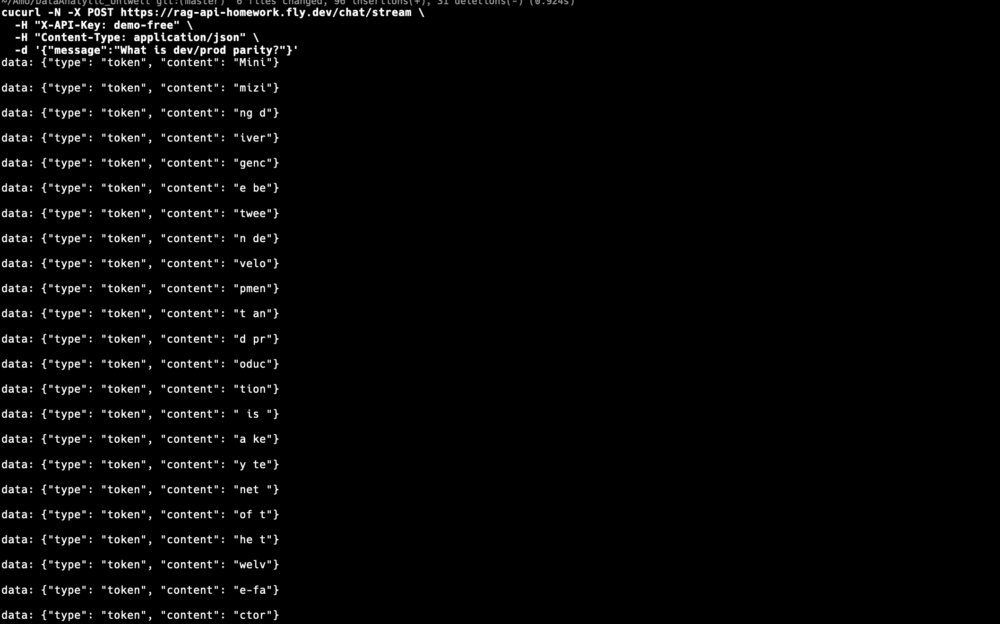
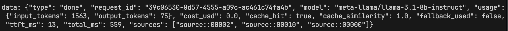
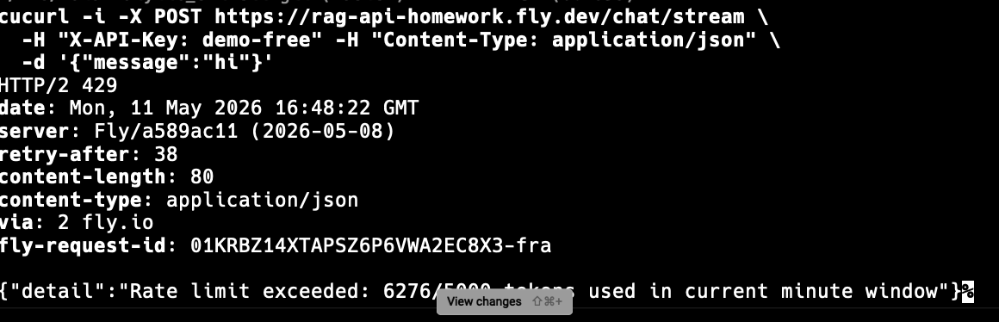
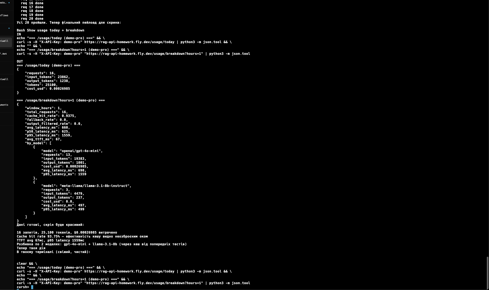
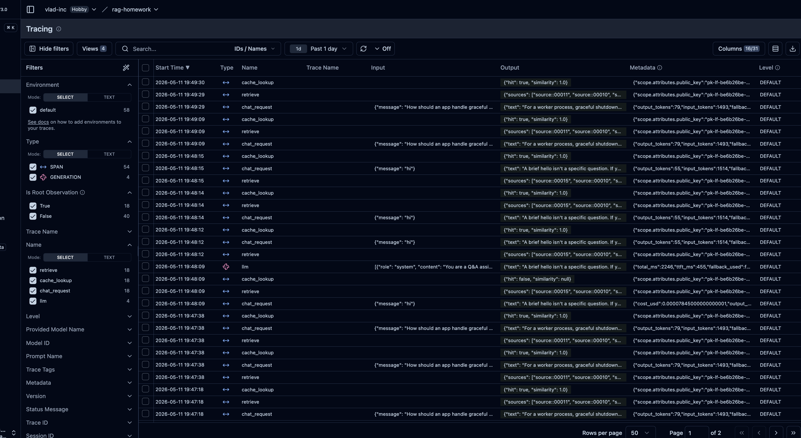

# RAG API — Q&A bot про "The Twelve-Factor App"

Production-ready RAG сервіс із усіма ключовими шарами: streaming, semantic cache,
rate limit, cost tracking, multi-provider fallback, prompt injection defense,
observability.

**Public URL:** https://rag-api-homework.fly.dev
**Swagger:** https://rag-api-homework.fly.dev/docs

## Що зроблено

| Шар | Реалізація |
|---|---|
| **RAG** | 12-Factor → chunks (500 tok, overlap 50) → MiniLM-L6-v2 → pgvector (top-3, cosine) |
| **Streaming** | SSE через `sse-starlette`, disconnect handling, counters `active/aborted/completed` |
| **Auth** | 3 API ключі з tier metadata (`demo-free` / `demo-pro` / `demo-enterprise`) |
| **Rate limit** | Token bucket у Redis (INCR/EXPIRE, без Lua — Upstash-compatible) |
| **Semantic cache** | pgvector таблиця `cache_entries`, threshold 0.80, той самий embedding що для RAG |
| **Cost tracking** | Postgres `cost_records` + `/usage/today` + `/usage/breakdown` з p50/p95 latency |
| **Fallback** | Chain з 3 моделей на tier, circuit breaker (5 fails/60s), 15s timeout, semaphore(20) |
| **Security** | 7 regex-патернів на input → 400, post-stream output filter → `output_filtered=true` |
| **Observability** | Langfuse Cloud — кожен запит = trace з prompt, completion, usage |
| **Deploy** | Fly.io (`fra`), `auto_stop_machines=false`, Supabase Postgres, Upstash Redis |

## Endpoints

```
POST /chat/stream       — SSE RAG (X-API-Key)
POST /chat              — non-streaming (X-API-Key)
GET  /usage/today       — витрати за сьогодні (X-API-Key)
GET  /usage/breakdown   — breakdown по моделях, hit rate, latency (X-API-Key)
GET  /health            — liveness + counters
```

## Скріншоти

### 1. Streaming у терміналі (`curl -N`)
Токени надходять по черзі, не одним блоком.


### 2. `sources: [...]` у `done` event
RAG повертає chunk_id, з яких сформована відповідь.


### 3. Rate limit 429 + `Retry-After`
Token bucket переповнений → відмова з кількістю секунд до скидання.


### 4. `/usage/today` після 20+ запитів
Реальна сума витрат, розбивка по моделях, p50/p95 latency.


### 5. Langfuse dashboard
Trace з повним prompt'ом (system + retrieved chunks + user query) і completion.


## Як протестити швидко

```bash
# Streaming
curl -N -X POST https://rag-api-homework.fly.dev/chat/stream \
  -H "X-API-Key: demo-free" -H "Content-Type: application/json" \
  -d '{"message":"What is dev/prod parity?"}'

# Або через Swagger у браузері
open https://rag-api-homework.fly.dev/docs   # Authorize → demo-free

# Або повний smoke-test одною командою (6 сценаріїв)
scripts/smoke.sh https://rag-api-homework.fly.dev
```

## Демо API ключі

| Key | Tier | Tokens/min | Primary model |
|---|---|---|---|
| `demo-free` | free | 5,000 | llama-3.1-8b-instruct |
| `demo-pro` | pro | 20,000 | gpt-4o-mini |
| `demo-enterprise` | enterprise | 100,000 | gpt-4o |

## Стек

- **Backend:** FastAPI · Uvicorn · Pydantic · psycopg3 (async)
- **LLM:** OpenRouter (OpenAI-compatible SDK, 200+ моделей через один ключ)
- **Embeddings:** sentence-transformers `all-MiniLM-L6-v2` (локально, 384 dim, безкоштовно)
- **Postgres:** Supabase з pgvector (chunks + cache + cost у одній БД)
- **Redis:** Upstash (TLS, rate limit + counters)
- **Observability:** Langfuse Cloud
- **Deploy:** Fly.io + Docker (single-stage slim image, 419 MB)

## Локальна розробка

```bash
cp .env.example .env                       # додай OPENROUTER_API_KEY
docker compose up -d                       # Postgres+pgvector і Redis
python3.11 -m venv .venv && source .venv/bin/activate
pip install -e .
python -m scripts.index                    # індексує 12-Factor у pgvector
uvicorn app.main:app --reload --port 8000
```

## Структура проєкту

```
app/
├─ main.py             — FastAPI + pipeline
├─ rag.py              — retrieve(query) → (embedding, top-k chunks)
├─ cache.py            — semantic cache (pgvector)
├─ llm_stream.py       — streaming + fallback chain
├─ circuit_breaker.py  — per-model failure breaker
├─ rate_limit.py       — Redis token bucket
├─ cost.py             — cost record + breakdown
├─ pricing.py          — {model: $/1M tokens}
├─ security.py         — prompt injection patterns + audit logs
└─ observability.py    — Langfuse client

scripts/
├─ index.py            — chunker + indexer
├─ init_db.sql         — schema + pgvector
└─ smoke.sh            — end-to-end smoke test

data/source.md         — The Twelve-Factor App
Dockerfile             — single-stage slim image
fly.toml               — Fly config (auto_stop_machines=false)
```

## Деталі реалізації

Більш докладно про дизайн-рішення (single embedding per request, чому threshold 0.80,
як працює fallback before-first-token, чому fixed-window rate limit) — у комітах
та коментарях у коді. Інструкція з deploy у [DEPLOY.md](./DEPLOY.md).
